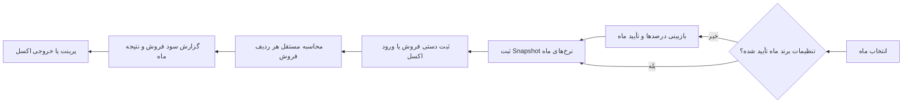
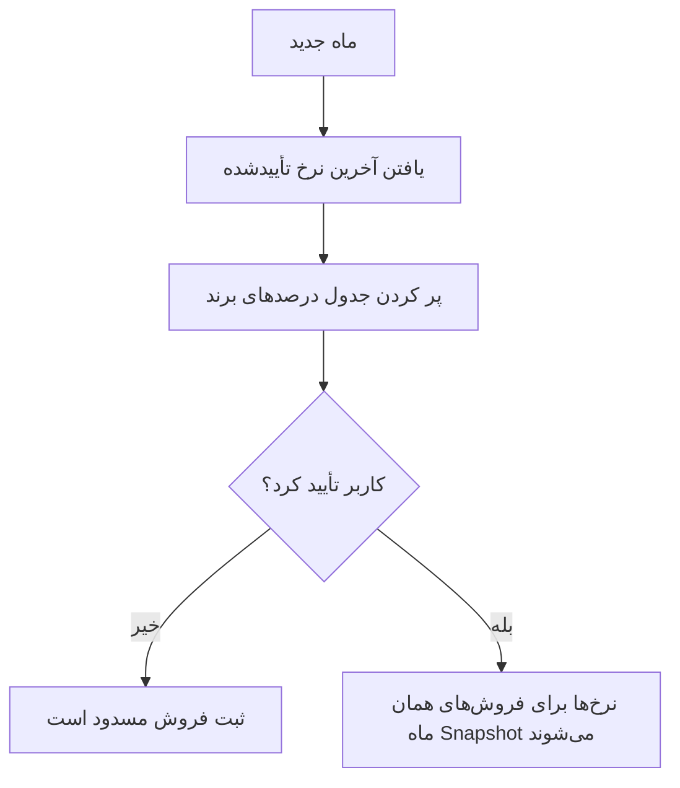

# سامانه مدیریت سود فروش ماهانه

<p align="center">
  <strong>محاسبهٔ شفاف، مستقل و ماه‌به‌ماه سود فروش</strong>
</p>

<p align="center">
  ثبت دستی و اکسل · تنظیمات برند ماهانه · پشتیبان‌گیری محلی · خروجی اکسل و پرینت
</p>

<p align="center">
  
  
  
  
</p>

---

## مسئله‌ای که حل می‌کند

این برنامه برای محاسبهٔ سود فروش طراحی شده است؛ نه انبارداری. برای هر ردیف فروش، قیمت خرید تخمینی از **قیمت همان فروش** استخراج می‌شود. بنابراین اگر یک کالا در دو زمان با قیمت متفاوت فروخته شود، محاسبهٔ یکی روی دیگری اثر نمی‌گذارد.

> خرید، موجودی، FIFO و مغایرت عمداً در این نسخه وجود ندارند.

## جریان کار



## فرمول محاسبه

برای هر فروش و با Snapshot درصدهای برند در همان ماه:

```text
قیمت خرید اولیهٔ تخمینی واحد = قیمت فروش واحد ÷ (۱ + مارک‌آپ)
هزینه خالص تخمینی واحد = قیمت خرید اولیه × (۱ − تخفیف خرید − آفر)
هزینهٔ کل فروش = هزینه خالص واحد × تعداد

دریافتی واقعی = (مبلغ فاکتور − کسورات) ×
                 [سهم چکی + سهم نقدی × (۱ − تخفیف نقدی)]

سود خالص فروش = دریافتی واقعی − هزینهٔ کل فروش
نتیجه ماه = مجموع سود خالص فروش‌ها − هزینه ثابت ماه
```

## تنظیمات ماهانهٔ برند

هر ماه باید یک‌بار تأیید شود. برنامه جدول را با آخرین تنظیم معتبرِ قبل از آن پر می‌کند، اما تا زمانی که کاربر آن را تأیید نکند، ثبت یا ورود فروش برای آن ماه ممکن نیست.



این طراحی مانع می‌شود که تغییر درصدهای یک ماه، گزارش ماه‌های گذشته را تغییر دهد.

## قابلیت‌ها

| بخش | توضیح |
| --- | --- |
| فروش | ثبت دستی، ورود اکسل، جست‌وجو و ویرایش فروش |
| هزینهٔ هر فروش | محاسبهٔ خودکار از قیمت همان ردیف یا ثبت دستی با دلیل |
| برندها | پیشوند کد کالا و درصدهای ماهانهٔ قابل تأیید |
| گزارش‌ها | گزارش ماه و بازه، نمودار، پرینت و خروجی اکسل |
| پشتیبان | پشتیبان دستی و پشتیبان خودکار هنگام خروج |
| داده | SQLite محلی؛ بدون وابستگی به سرور یا اینترنت |

## ورود اکسل

فایل‌های `.xlsx` و `.xls` SpreadsheetML پشتیبانی می‌شوند.

| ستون | کاربرد |
| --- | --- |
| تاریخ | تاریخ شمسی مانند `14050627` |
| نام حساب | نام مشتری |
| کد کالا | تشخیص کالا و برند از پیشوند |
| نام کالا | نام نمایشی کالا |
| تعداد واحد اصلی / تعداد | تعداد فروش |
| قیمت | قیمت فروش واحد |
| قیمت کل | مبلغ فاکتور |
| کسورات | کسورات فاکتور |

اگر برند یک کد از پیشوندها مشخص نباشد، ورود متوقف می‌شود تا ابتدا برند یا پیشوند در صفحهٔ «برندها» تعیین شود. ردیف‌های یک فایل نیز با شناسهٔ فایل و شمارهٔ ردیف فقط یک‌بار وارد می‌شوند.

## راه‌اندازی

### ساخت روی ویندوز

پیش‌نیاز: .NET 10 SDK

```powershell
./build-windows.ps1
```

این فرمان ابتدا تست‌های قواعد مالی، پایگاه داده و خروجی اکسل را اجرا می‌کند و سپس بستهٔ نصب ویندوز را می‌سازد.

### دریافت build از GitHub

اگر .NET روی سیستم ندارید، workflow ریپازیتوری را اجرا کنید. پس از build موفق، فایل `MonthlyProfit-Windows-x64.zip` در بخش **Releases** به‌صورت Pre-release قابل دانلود است.

## محل داده‌ها و مهاجرت

داده‌ها در مسیر زیر نگه‌داری می‌شوند:

```text
%LOCALAPPDATA%\MonthlyProfit\Data\monthly-profit.sqlite
```

نسخهٔ `0.6` ساختار قدیمی خرید/موجودی را با دفتر فروش‌محور جدید جایگزین می‌کند؛ پیش از نخستین اجرا، از نسخهٔ قبلی پشتیبان بگیرید.

## حریم خصوصی

تمام داده‌ها روی همان رایانه ذخیره می‌شوند. برنامه برای محاسبه یا نگه‌داری داده‌های مالی به سرویس ابری وابسته نیست.
